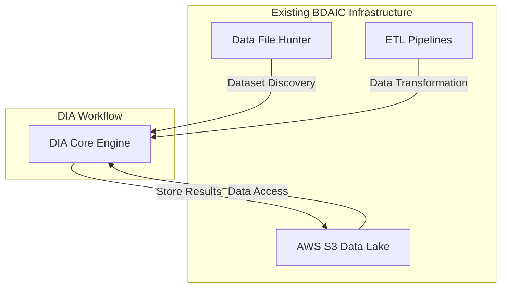
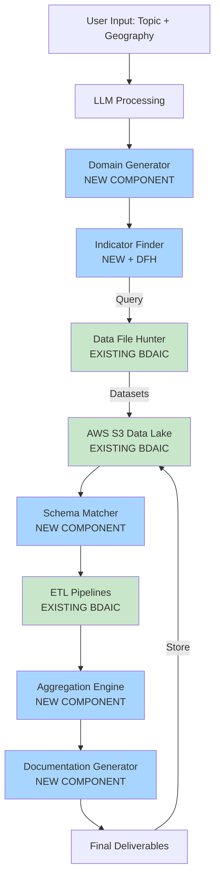
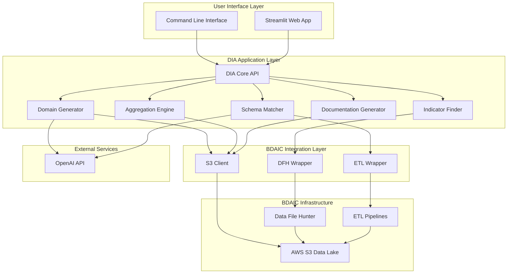

# Domain Indicator Aggregator (DIA)

## Overview

The Domain Indicator Aggregator (DIA) is an AI-powered tool that automates the creation of composite indicators and datasets for community analysis. Given a research prompt or community issue, DIA intelligently discovers, merges, and analyzes relevant data to produce meaningful aggregated indicators and scoring methodologies.

DIA transforms a multi-week manual research process into an automated workflow that delivers actionable results within hours.

---

## Planned Development Approach

This section outlines the proposed development strategy for building DIA, combining existing BDAIC components with new purpose-built modules to create a comprehensive automated indicator aggregation system.

### Strategy Overview

The development approach follows two parallel tracks:

1. **Integration Track:** Leverage existing BDAIC infrastructure and components
2. **Development Track:** Build new DIA-specific components for the complete workflow

---

## Phase 1: Utilizing Current BDAIC Components

### Components to Integrate

| BDAIC Component | Integration Purpose | Status | Priority |
|-----------------|---------------------|--------|----------|
| **Data File Hunter (DFH)** | Initial data discovery and dataset identification | ✅ Ready | High |
| **AWS S3 Data Lake** | Primary data storage and retrieval | ✅ Ready | High |
| **Existing ETL Pipelines** | Basic data transformation and loading | ✅ Ready | Medium |
| **Semantic Pattern Generator (SPG)** | Enhanced semantic analysis of topics and domains | 🔮 Future | Low |
| **Indicator Pattern Generator (IPG)** | Pattern-based indicator discovery | 🔮 Future | Low |

### Integration Architecture



### Reuse Strategy

- **Data Discovery:** Use DFH to identify candidate datasets based on topic keywords and domains
- **Data Access:** Leverage existing S3 bucket structure and access patterns
- **Basic Transformations:** Utilize current ETL jobs for standard data cleaning and formatting operations
- **Storage:** Store all DIA outputs back to S3 Data Lake using established conventions

---

## Phase 2: Creating New DIA Components

### New Components Required

The following components will be developed specifically for the DIA workflow:

| Component | Purpose | Inputs | Outputs | Dependencies |
|-----------|---------|--------|---------|--------------|
| **Domain Generator** | Automatically identifies domains (vulnerability categories) from topic | User topic + relevant data | List of domains with descriptions | LLM, clustering algorithms |
| **Indicator Finder** | Discovers and retrieves indicators for each domain | Domains + geography | Candidate indicator datasets | DFH, Data Lake |
| **Schema Matcher** | Analyzes and recommends dataset integration strategies | Multiple datasets | Join recommendations + transformations | LLM, schema analysis |
| **Aggregation Engine** | Computes composite indicators using multiple methodologies | Cleaned, merged datasets | Aggregated scores + validation metrics | Statistical libraries |
| **Documentation Generator** | Creates comprehensive methodology documentation | All workflow outputs | Reports, visualizations, metadata | Reporting templates |

### Detailed Component Specifications

#### 1. Domain Generator
**Type:** New Component  
**Technology:** Python + LLM (OpenAI) + scikit-learn

**Functionality:**
- Accept natural language topic descriptions
- Perform topic clustering on related datasets and keywords
- Use LLM to interpret clusters and define meaningful domain categories
- Validate domains against existing literature and frameworks

**Deliverables:**
- Domain taxonomy for the given topic
- Confidence scores for each domain
- Domain relationship mappings

#### 2. Indicator Finder
**Type:** New Component (with DFH Integration)  
**Technology:** Python + BDAIC DFH wrapper

**Functionality:**
- Query Data Lake for indicators matching each domain
- Trigger DFH for automated discovery when needed
- Filter and rank indicators by relevance and data quality
- Support both structured and unstructured data sources

**Deliverables:**
- Candidate indicator list per domain
- Data quality scores
- Coverage analysis by geography

#### 3. Schema Matcher
**Type:** New Component  
**Technology:** Python + LLM for semantic matching

**Functionality:**
- Analyze schema structures across candidate datasets
- Identify common join keys and geographic hierarchies
- Recommend transformation steps for integration
- Detect potential data conflicts and quality issues

**Deliverables:**
- Integration roadmap for datasets
- SQL/Python transformation scripts
- Data quality warnings

#### 4. Aggregation Engine
**Type:** New Component  
**Technology:** Python + pandas + numpy + scikit-learn

**Functionality:**
- Compute composite indicators using multiple methods:
  - Weighted/unweighted averages
  - Principal Component Analysis (PCA)
  - Regression-based scoring
  - Percentile ranking
- Generate statistical validation metrics
- Compare methodology performance

**Deliverables:**
- Aggregated indicator datasets
- Method comparison report
- Statistical validation metrics (R², variance explained, etc.)

#### 5. Documentation Generator
**Type:** New Component  
**Technology:** Python + templating (Jinja2) + visualization libraries

**Functionality:**
- Generate methodology documentation
- Create data quality assessments
- Produce visualization-ready outputs
- Package complete deliverable sets

**Deliverables:**
- Methodology PDF/HTML reports
- CSV/JSON data exports
- Visualization files (charts, maps, dashboards)

---

## Complete DIA Workflow

### End-to-End Process Flow



**Legend:**
- 🔵 Blue: New DIA Components
- 🟢 Green: Existing BDAIC Components

### Workflow Steps

#### Step 1: User Input
- **Approach:** Web interface (Streamlit) or CLI
- **Components Used:** None (entry point)

#### Step 2: Topic Clustering & Domain Generation
- **Approach:** LLM + clustering algorithms
- **Components Used:** Domain Generator (NEW)

#### Step 3: Indicator Identification
- **Approach:** Search + discovery
- **Components Used:** Indicator Finder (NEW) + Data File Hunter (EXISTING)

#### Step 4: Data Integration & Preparation
- **Approach:** Schema analysis + ETL
- **Components Used:** Schema Matcher (NEW) + ETL Pipelines (EXISTING) + Data Lake (EXISTING)

#### Step 5: Aggregation & Scoring
- **Approach:** Statistical computation
- **Components Used:** Aggregation Engine (NEW)

#### Step 6: Output Generation
- **Approach:** Report generation + visualization
- **Components Used:** Documentation Generator (NEW)

---

## Component Assessment Matrix

### Comprehensive Status Overview

| Component | Type | Status | Development Effort | Timeline | Dependencies |
|-----------|------|--------|-------------------|----------|--------------|
| **AWS S3 Data Lake** | Existing | ✅ Production Ready | N/A | Available Now | None |
| **Data File Hunter (DFH)** | Existing | ✅ Production Ready | N/A | Available Now | S3 Access |
| **ETL Pipelines** | Existing | ✅ Production Ready | N/A | Available Now | S3 Access |
| **Domain Generator** | New | 🔨 To Build | High (3-4 weeks) | Sprint 1-2 | LLM API, Clustering libs |
| **Indicator Finder** | New | 🔨 To Build | Medium (2-3 weeks) | Sprint 2 | DFH, Domain Generator |
| **Schema Matcher** | New | 🔨 To Build | High (3-4 weeks) | Sprint 3 | LLM API, Indicator Finder |
| **Aggregation Engine** | New | 🔨 To Build | Medium (2-3 weeks) | Sprint 3-4 | Schema Matcher |
| **Documentation Generator** | New | 🔨 To Build | Low (1-2 weeks) | Sprint 4 | Aggregation Engine |
| **SPG Integration** | Future | 🔮 Planned | TBD | Phase 3+ | SPG availability |
| **IPG Integration** | Future | 🔮 Planned | TBD | Phase 3+ | IPG availability |

### Risk Assessment

| Component | Risk Level | Mitigation Strategy |
|-----------|-----------|---------------------|
| Domain Generator | Medium | Validate LLM outputs with domain experts; build fallback rule-based system |
| Schema Matcher | High | Implement manual review step; extensive testing with diverse datasets |
| Aggregation Engine | Low | Use well-established statistical methods; comprehensive validation |
| DFH Integration | Low | DFH is production-ready; clear API documentation exists |

---

## MVP Acceptance Criteria

### Functional Requirements

- [ ] Accept natural language topic prompts
- [ ] Automatically cluster topics to define domains (minimum 3-7 domains per topic)
- [ ] Identify and retrieve relevant datasets from the Data Lake (minimum 80% recall)
- [ ] Perform basic data merging at common geographic levels (county, state, national)
- [ ] Generate at least three aggregation methodologies with statistical justification
- [ ] Produce documented output dataset with indicator calculations
- [ ] Include data quality assessments in all outputs

### Technical Requirements

- [ ] Process complete workflow in <2 hours for typical use case
- [ ] Successfully integrate with DFH and S3 Data Lake
- [ ] Handle datasets with up to 1M rows
- [ ] Support geographic granularities: block group, tract, county, state, national
- [ ] Provide REST API for programmatic access
- [ ] Generate reproducible results with version tracking

### Documentation Requirements

- [ ] Methodology documentation for each aggregation method
- [ ] Data lineage and provenance tracking
- [ ] API documentation with examples
- [ ] User guide with tutorials
- [ ] Technical architecture documentation

---

## Technical Architecture

### System Architecture Diagram



### Technology Stack

**Programming Languages:**
- Python 3.9+ (primary)

**Core Libraries:**
- `pandas` - data manipulation
- `numpy` - numerical computing
- `scikit-learn` - clustering, PCA, statistical methods
- `openai` - LLM integration
- `boto3` - AWS S3 access
- `pydantic` - data validation
- `SQLAlchemy` - database operations (if needed)

**Visualization & Reporting:**
- `matplotlib`, `seaborn`, `plotly` - charts and graphs
- `jinja2` - report templating
- `markdown` - documentation generation

**Web Interface (MVP):**
- `streamlit` - rapid prototyping UI

**Development & Testing:**
- `pytest` - unit and integration testing
- `black` - code formatting
- `mypy` - type checking
- `poetry` or `pip-tools` - dependency management

---

## Repository Structure

```
dia/
├── README.md                          # This file
├── pyproject.toml                     # Project dependencies and metadata
├── .env.example                       # Environment variable template
├── .gitignore
│
├── src/
│   ├── dia/
│   │   ├── __init__.py
│   │   ├── api/                       # REST API (future)
│   │   │   ├── __init__.py
│   │   │   └── routes.py
│   │   │
│   │   ├── components/                # NEW DIA components
│   │   │   ├── __init__.py
│   │   │   ├── domain_generator.py    # Domain Generator
│   │   │   ├── indicator_finder.py    # Indicator Finder
│   │   │   ├── schema_matcher.py      # Schema Matcher
│   │   │   ├── aggregation_engine.py  # Aggregation Engine
│   │   │   └── documentation_generator.py
│   │   │
│   │   ├── integrations/              # BDAIC component wrappers
│   │   │   ├── __init__.py
│   │   │   ├── dfh_client.py          # Data File Hunter wrapper
│   │   │   ├── s3_client.py           # S3 Data Lake client
│   │   │   └── etl_client.py          # ETL pipeline wrapper
│   │   │
│   │   ├── models/                    # Data models
│   │   │   ├── __init__.py
│   │   │   ├── domain.py
│   │   │   ├── indicator.py
│   │   │   └── dataset.py
│   │   │
│   │   ├── utils/                     # Utilities
│   │   │   ├── __init__.py
│   │   │   ├── logging.py
│   │   │   ├── validation.py
│   │   │   └── config.py
│   │   │
│   │   └── workflows/                 # Orchestration
│   │       ├── __init__.py
│   │       └── dia_pipeline.py        # Main workflow orchestration
│   │
│   └── cli/                           # Command-line interface
│       ├── __init__.py
│       └── main.py
│
├── notebooks/                         # Jupyter notebooks for analysis
│   ├── 01_domain_generation_prototype.ipynb
│   ├── 02_indicator_discovery_test.ipynb
│   └── 03_aggregation_methods_comparison.ipynb
│
├── tests/                             # Test suite
│   ├── unit/
│   │   ├── test_domain_generator.py
│   │   ├── test_indicator_finder.py
│   │   ├── test_schema_matcher.py
│   │   ├── test_aggregation_engine.py
│   │   └── test_documentation_generator.py
│   ├── integration/
│   │   ├── test_dfh_integration.py
│   │   ├── test_s3_integration.py
│   │   └── test_end_to_end_workflow.py
│   └── fixtures/
│       └── sample_data/
│
├── docs/                              # Documentation
│   ├── architecture.md                # Technical architecture details
│   ├── methodology.md                 # Aggregation methodologies
│   ├── user_guide.md                  # User documentation
│   ├── api_reference.md               # API documentation
│   ├── bdaic_integration.md           # BDAIC component integration guide
│   └── development.md                 # Development setup and guidelines
│
├── examples/                          # Example usage
│   ├── housing_vulnerability/
│   ├── health_disparities/
│   └── food_insecurity/
│
└── configs/                           # Configuration files
    ├── aggregation_methods.yaml
    ├── domain_templates.yaml
    └── visualization_styles.yaml
```

---

## Development Phases & Timeline

### Phase 1: Foundation (Weeks 1-4)
**Deliverables:**
- Repository setup with proper structure
- BDAIC integration layer (DFH, S3, ETL wrappers)
- Basic CLI interface
- Domain Generator prototype

**Milestones:**
- [ ] Can accept user input and parse topics
- [ ] Can access Data Lake and retrieve datasets via DFH
- [ ] Can generate domains for simple topics

### Phase 2: Core Components (Weeks 5-10)
**Deliverables:**
- Indicator Finder (with DFH integration)
- Schema Matcher
- Aggregation Engine (basic methods)

**Milestones:**
- [ ] Can discover indicators for defined domains
- [ ] Can merge datasets at common geographic levels
- [ ] Can compute at least one aggregation methodology

### Phase 3: Automation & Output (Weeks 11-14)
**Deliverables:**
- Documentation Generator
- Complete workflow orchestration
- Multiple aggregation methods
- Validation framework

**Milestones:**
- [ ] End-to-end workflow executes successfully
- [ ] Generates publication-quality outputs
- [ ] Includes statistical validation

### Phase 4: MVP Polish (Weeks 15-16)
**Deliverables:**
- Comprehensive testing
- User documentation
- Example use cases
- Performance optimization

**Milestones:**
- [ ] All MVP acceptance criteria met
- [ ] User guide and API documentation complete
- [ ] Initial user testing completed

---

## Visualization Examples

The DIA system will generate the following visualization types:

### Domain Analysis
- **Heatmap:** Domain scores across communities
- **Radar Chart:** Multi-domain comparison for selected communities
- **Bar Chart:** Top/bottom communities by domain

### Indicator Distribution
- **Histogram:** Distribution of indicator values
- **Box Plot:** Indicator variance across geographic regions
- **Correlation Matrix:** Relationships between indicators

### Community Profiling
- **Cluster Plot:** Communities grouped by vulnerability similarity
- **Geographic Maps:** Choropleth maps of aggregated scores
- **Time Series:** Temporal trends (if temporal data available)

### Methodology Comparison
- **Method Performance:** Comparison of aggregation approaches
- **Sensitivity Analysis:** Impact of different weighting schemes
- **Validation Metrics:** R², explained variance, convergent validity

---

## Integration with BDAIC Ecosystem

### Data File Hunter (DFH) Integration

**Purpose:** Automated dataset discovery

**Integration Points:**
- Indicator Finder calls DFH API to search for relevant datasets
- DFH returns dataset metadata (location, schema, coverage)
- DIA evaluates datasets for quality and relevance

**Example Workflow:**
```python
from dia.integrations.dfh_client import DFHClient

dfh = DFHClient()
datasets = dfh.search(
    keywords=["poverty", "income", "unemployment"],
    geography="county",
    year_range=(2018, 2023)
)
```

### AWS S3 Data Lake Integration

**Purpose:** Data storage and retrieval

**Integration Points:**
- Read source datasets from standardized S3 buckets
- Write DIA outputs to designated output buckets
- Maintain data versioning and lineage

**Bucket Structure:**
```
s3://bdaic-data-lake/
├── raw/                    # Raw source data (read)
├── processed/              # ETL outputs (read)
└── dia/                    # DIA outputs (write)
    ├── indicators/
    ├── reports/
    └── metadata/
```

### ETL Pipeline Integration

**Purpose:** Data transformation

**Integration Points:**
- Leverage existing ETL jobs for standard transformations
- Submit new ETL jobs for custom transformations via Schema Matcher
- Monitor ETL job status and retrieve results

---

## Success Metrics

### Performance Metrics

| Metric | Target | Measurement Method |
|--------|--------|-------------------|
| **Processing Speed** | <2 hours for typical workflow | End-to-end execution time |
| **Data Integration Success Rate** | ≥80% of relevant datasets merged | # successful merges / # attempted |
| **Method Accuracy** | Statistical validation passes | R² >0.7, cross-validation |
| **System Uptime** | ≥95% | Monitoring logs |

### Quality Metrics

| Metric | Target | Measurement Method |
|--------|--------|-------------------|
| **Output Quality** | Match/exceed manual development | Expert review ratings |
| **Documentation Completeness** | 100% of outputs documented | Automated checks |
| **Code Coverage** | ≥80% | pytest-cov |
| **User Satisfaction** | ≥4.0/5.0 | User surveys |

### Adoption Metrics

| Metric | Target | Measurement Method |
|--------|--------|-------------------|
| **User Adoption** | ≥90% of internal staff | Usage logs |
| **Projects Using DIA** | ≥5 projects in first 6 months | Project tracking |
| **Repeat Usage** | ≥70% users return | Usage logs |

---

## Future Enhancements (Post-MVP)

### Phase 3+: Advanced Features

1. **Enhanced BDAIC Integration**
   - Full SPG integration for semantic pattern discovery
   - IPG integration for pattern-based indicator generation
   - Real-time data source monitoring

2. **Advanced Analytics**
   - Machine learning-based predictive indicators
   - Temporal trend analysis and forecasting
   - Causal inference capabilities
   - Anomaly detection

3. **Collaboration Features**
   - Multi-user workspaces
   - Indicator review and approval workflows
   - Version control for indicator definitions
   - Commenting and annotation

4. **API & Extensibility**
   - Public REST API for external tool integration
   - Plugin architecture for custom aggregation methods
   - Integration with BI tools (Tableau, Power BI)
   - Export to GIS formats (GeoJSON, Shapefile)

5. **Advanced Validation**
   - Cross-dataset validation frameworks
   - Sensitivity analysis automation
   - Uncertainty quantification
   - Benchmarking against established indices

---

## Getting Started

### Prerequisites

- Python 3.9 or higher
- AWS credentials with S3 access
- OpenAI API key (for LLM features)
- Access to BDAIC Data Lake
- Git

### Installation

```bash
# Clone the repository
git clone https://github.com/bdaic/dia.git
cd dia

# Install dependencies
pip install -e .

# Or using poetry
poetry install

# Copy environment template
cp .env.example .env

# Edit .env with your credentials
# AWS_ACCESS_KEY_ID=your_key
# AWS_SECRET_ACCESS_KEY=your_secret
# OPENAI_API_KEY=your_openai_key
```

### Quick Start

```bash
# Run via CLI
dia run --topic "housing vulnerability" --geography "county" --state "TN"

# Or via Python
python -c "
from dia.workflows.dia_pipeline import DIAPipeline

pipeline = DIAPipeline()
results = pipeline.run(
    topic='housing vulnerability',
    geography='county',
    state='TN'
)
print(results.summary())
"
```

---

## Contributing

We welcome contributions! Please see our [Contributing Guidelines](docs/development.md) for details.

### Development Setup

```bash
# Install development dependencies
pip install -e ".[dev]"

# Run tests
pytest

# Run linting
black src/
mypy src/

# Run full test suite with coverage
pytest --cov=dia tests/
```

---

## Documentation

Comprehensive documentation is available in the `/docs` folder:

- [Architecture Documentation](docs/architecture.md)
- [User Guide](docs/user_guide.md)
- [API Reference](docs/api_reference.md)
- [BDAIC Integration Guide](docs/bdaic_integration.md)
- [Methodology Documentation](docs/methodology.md)

---

## Related Projects

- [Data File Hunter (DFH)](link-to-dfh) - Automated dataset discovery tool
- [BDAIC Data Lake](link-to-data-lake) - Centralized data repository
- [Semantic Pattern Generator (SPG)](link-to-spg) - Semantic analysis tool (coming soon)
- [Indicator Pattern Generator (IPG)](link-to-ipg) - Pattern-based indicator tool (coming soon)

---

## License

*[Add your license information here - e.g., MIT, Apache 2.0, proprietary]*

---

## Authors

**BDAIC – DIA Development Team**

For questions or support, please contact: [team-email@bdaic.org]

---

## Acknowledgments

Special thanks to the BDAIC team for their existing infrastructure and tools that make this project possible.

---

## References

- BDAIC Github Documentation: [SharePoint Link]
- [Add other relevant references]

---

**Last Updated:** October 30, 2025  
**Version:** 1.0.0 (Initial Proposal)
