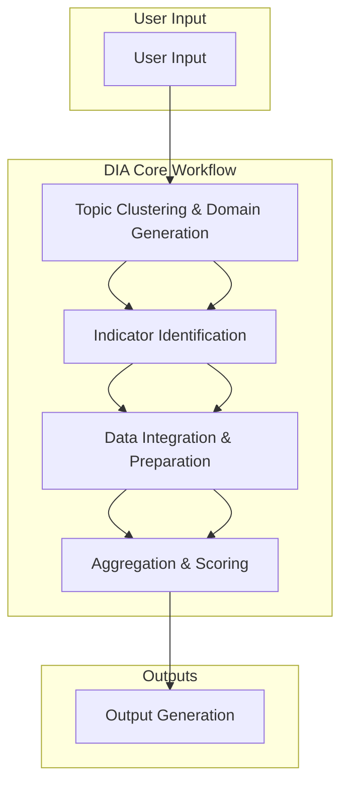
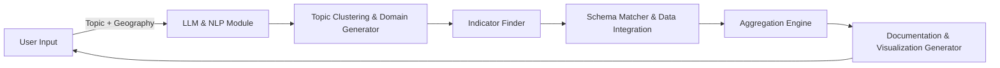

# Domain Indicator Aggregator (DIA)

## Overview

The Domain Indicator Aggregator (DIA) is an AI-powered tool that automates the creation of composite indicators and datasets for community analysis. Given a research prompt or community issue, DIA intelligently discovers, merges, and analyzes relevant data to produce meaningful aggregated indicators and scoring methodologies.

DIA transforms a multi-week manual research process into an automated workflow that delivers actionable results within hours.

----------

## Planned Development Approach

### Phase 1: Integration with Existing BDAIC Components

Leverage current BDAIC discovery tools where applicable:

-   **Data File Hunter (DFH)**
-   **Semantic Pattern Generator (SPG)** _(future enhancement)_
-   **Indicator Pattern Generator (IPG)** _(future enhancement)_

Additional capabilities:

-   Access and query AWS S3 Data Lake
-   Reuse existing ETL pipelines for basic data transformation

### Phase 2: New Components for DIA Workflow

Component

Description

**Domain Generator**

Accepts topic input and outputs a set of domains (categories of vulnerability) using clustering of topic-relevant data and LLM interpretation

**Indicator Finder**

Identifies indicators representing each domain from the Data Lake or via BDAIC components

**Schema Matcher**

Recommends dataset joins and transformations for integration

**Aggregation Engine**

Computes composite indicators and index scores using weighted/unweighted, PCA, regression, and percentile ranking methods

**Documentation Generator**

Creates methodology reports, data quality assessments, and visualization-ready outputs

----------

## Functional Workflow

The DIA workflow consists of six main stages:



### Workflow Description

#### 1. User Input

-   **Input:** Natural language topic, geography, geographic granularity
-   **Process:** LLM interprets the topic; clustering identifies natural topic groupings for domains
-   **Output:** Structured query `{topic, domains, geography, granularity}`

#### 2. Topic Clustering & Domain Generation

-   **Input:** Structured query + relevant datasets
-   **Process:**
    -   Cluster related keywords, documents, and indicators to define domains automatically
    -   LLM validates and refines domain assignments
-   **Output:** List of domains for the topic

#### 3. Indicator Identification

-   **Input:** Domains + geography
-   **Process:** Search BDAIC Data Lake and optionally trigger discovery tools
-   **Output:** Candidate indicators per domain

#### 4. Data Integration & Preparation

-   **Input:** Candidate indicator datasets
-   **Process:** Schema alignment, geographic harmonization, temporal alignment, data quality validation
-   **Output:** Cleaned, merged datasets

#### 5. Aggregation & Scoring

-   **Input:** Merged datasets
-   **Process:** Compute composite indicators using weighted/unweighted, PCA, regression, percentile ranking
-   **Output:** Aggregated indicators + statistical validation metrics

#### 6. Output Generation

-   **Input:** Aggregated indicators + metadata
-   **Process:** Produce visualizations, reports, and documentation
-   **Output:**
    -   Indicator datasets (CSV, JSON)
    -   Methodology reports
    -   Visualization-ready charts (bar, radar, heatmap, cluster)
    -   Validation statistics

----------

## Component Assessment

Component

Status

Notes

Data Lake Access

✅ Ready

Can read/write S3 buckets

DFH Integration

✅ Ready

Initial indicator discovery

Domain Generator

🆕 New

Uses clustering + LLM for topic domain identification

Indicator Finder

🆕 New

Pipeline for structured/unstructured data

Schema Matcher

🆕 New

LLM-based schema analysis

Aggregation Engine

🆕 New

Supports multiple scoring methods

Documentation Generator

🆕 New

Automated report creation

----------

## MVP Acceptance Criteria

-   [ ] Accept natural language topic prompts
-   [ ] Cluster topics to define domains automatically
-   [ ] Identify and retrieve relevant datasets from the Data Lake
-   [ ] Perform basic data merging at common geographic levels
-   [ ] Generate at least three aggregation methodologies with statistical justification
-   [ ] Produce documented output dataset with indicator calculations
-   [ ] Include data quality assessments in outputs

----------

## Architecture Overview



### Technical Stack

-   **Frontend:** Streamlit (prototype) or CLI
-   **Processing:** Python with OpenAI LLM integration
-   **Storage:** AWS S3 Data Lake
-   **Libraries:** pandas, numpy, scikit-learn, optional ML libraries (TensorFlow/PyTorch)
-   **Design:** Modular component-based architecture for future expansion

----------

## Repository Structure

```
/src
  /components   # DIA modules (Domain Generator, Aggregation Engine, etc.)
  /integrations # Wrappers for BDAIC components & Data Lake access
  /data         # Example datasets / temporary storage
/docs           # Methodology, architecture, and user guides
README.md

```

----------

## Visualization Examples

-   **Heatmap:** Domain vs. Community score
-   **Radar Chart:** Comparison of communities across domains
-   **Cluster Plot:** Communities grouped by similarity in vulnerability indicators
-   **Workflow & Component Graphs:** To visualize data flow and processing steps

----------

## Future Enhancements

-   Full integration with all BDAIC discovery tools
-   Advanced schema matching & temporal alignment
-   Real-time data source monitoring & updates
-   Predictive indicators using machine learning
-   API endpoints for external tool integration
-   Collaborative workspace for indicator development
-   Advanced statistical validation frameworks

----------

## Success Metrics

Metric

Target

**Processing Speed**

Reduce manual indicator development from weeks to <2 hours

**Data Integration**

Successfully merge ≥80% of relevant datasets

**Methodology Accuracy**

Statistically validated aggregation methods

**User Adoption**

≥90% internal staff adoption

**Output Quality**

Indicators match or exceed manual development standards

----------

## Authors

**BDAIC – DIA Development Team**
